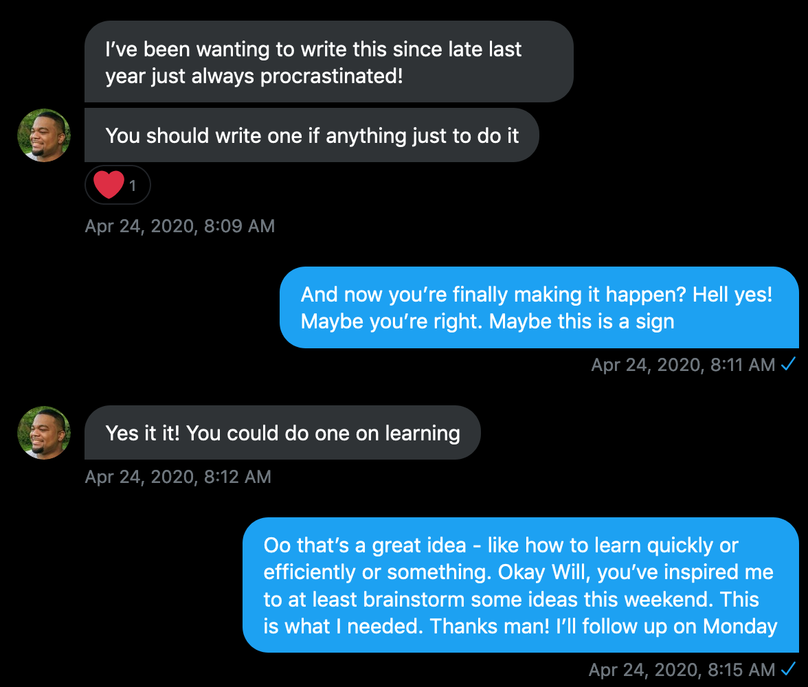
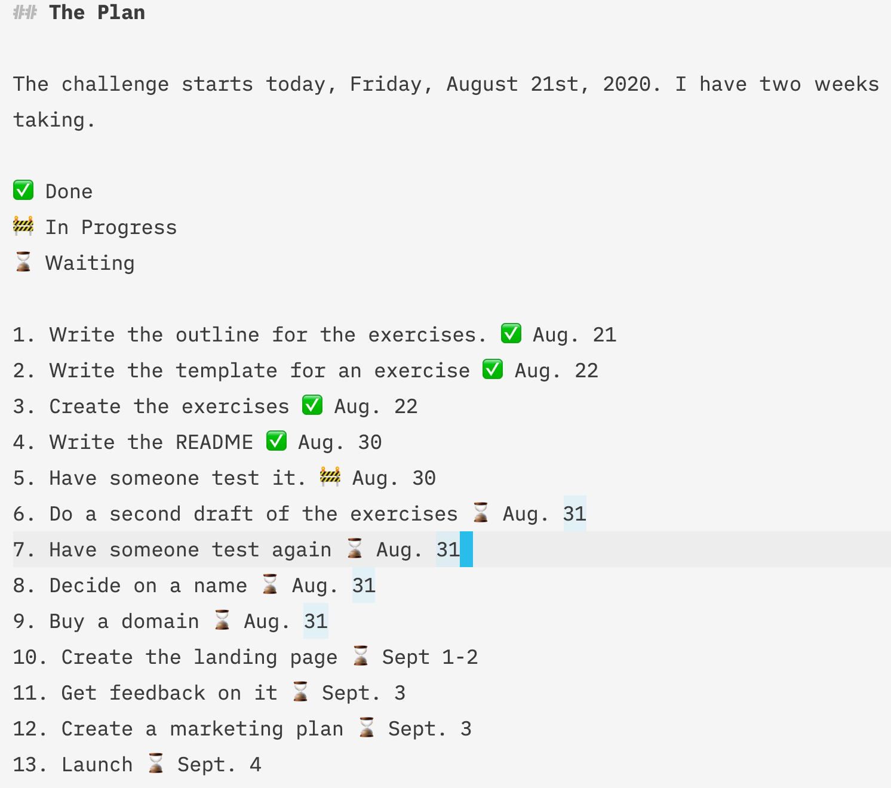
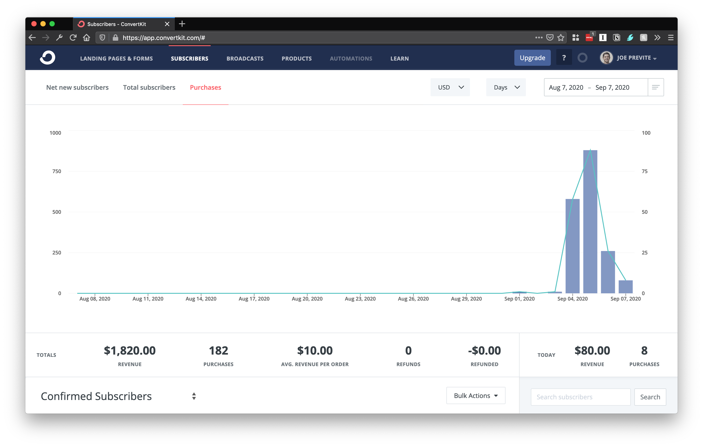

<!-- TODOS

- [ ] Fix weird Twitter embed error
- [ ] Add the other embeds for the positivie feedback tweets
- [ ] Convert newsletter sign up to ConvertKit
https://github.com/MichaelDeBoey/gatsby-remark-embedder/issues/41

-->

On September 4th, 2020, I launched my first product [Vim for VSCode](https://vimforvscode.com).

Today I'm going to share with you how I did it.

## Backstory

The whole idea for this started back when I started hearing about "info-products". I like to define it as a piece of content that people buy. The most common form I see is the ebook though there a variety of forms. I thought to myself as a teacher, this is what I want to learn more about: selling info-products like ebooks and video courses. It's probably one of the most common ways content creators [[making-money]] online.

### Push from my friend Will Johnson

I can't recall how it started, but after I saw multiple friends launching ebooks this summer, I told myself, "I want to do that."

My friend [Will](https://twitter.com/willjohnsonio) and I have been chatting about making info products since April 2020. He had his own book idea in mind. We both said we would push each other in that direction of coming up with an idea, and starting to write it.

### The tweet that inspired it all

https://twitter.com/dvassallo/status/1287210142459547648

Then, we saw [this tweet](https://twitter.com/dvassallo/status/1287210142459547648?s=20). This was back in July and I immediately bookmarked it. I told myself in August, I would give it a shot. I chatted with Will and he said was onboard to join me as well for the challenge.

### The #2WeekProduct challenge was born!

Neither myself nor Will knew anyone else that was interested in doing this with us. I set a day for August 21st - September 4th in my calendar for myself and Will. As the date approached, I started telling a few friends. One of those friends was [Lauro](https://twitter.com/laurosilvacom). Lauro loved the idea. I told him I would love to do it with a small group of people.

He suggested I post the challenge to the egghead and [Party Corgi](https://www.partycorgi.com/) Discords. It was a fantastic idea.

I ended up receiving more requests than I could handle. I chose Discord Group DMs, which are capped at 10 people. I told the other folks there would be a future round, which has [two groups](https://twitter.com/jsjoeio/status/1302727803771650048?s=20) running as I write this.

That's the back story behind my first product. Now onto actually building the product!

## Building the Product

If you have an idea, actually building it is the easiest part. At least, that's how it felt for me. Before the challenge started in August, I began thinking of ideas. "What could I build?" I asked myself. One idea I had been playing around with was exercises to teach you programming topics. I chatted with my friend [Prince](https://twitter.com/maxcell) who helped me smooth it out. Eventually, I landed on Vim. I knew enough Vim to teach it and I figured that was something I could build within two weeks.

### Planning it out

I have a full-time job so planning out my work for this challenge was essential. I came up with [this plan](https://twitter.com/jsjoeio/status/1297191136323227648?s=20):

I told myself I would work on it on my own time before work, after work and on the weekend. I think I spent maybe an hour in the morning, and an hour after work. On the weekends, it was a few hours. I didn't stick to the plan exactly, but having the rough outline made me think less and made it easier to get things done.

### Staying organized

To actually manage the project and keep track of tasks, notes and anything else, I used the following:

- [Foam](https://foambubble.github.io/foam/): my second brain, I have a long page of notes and thoughts
- [Notion](https://www.notion.so/product): for things I needed to write down while on the go or high-level goals for the day
- [VSCode](https://code.visualstudio.com/): I use Foam with VSCode, but I also built my product in VSCode (because they're exercises)

Ultimately the tools you use don't matter that much, but I'm sharing it case it helps you figure out what to use.

### Keeping myself accountable

Probably the most important part of this was having accountability. I used two forms:

- [tweet thread](https://twitter.com/jsjoeio/status/1296637530024980480?s=20): I kept a thread of my progress each day
- small group: the Group Discord DM I mentioned earlier. We had 10 people total

The tweet thread worked well as the medium for sharing progress while the small group provided a safe space for me to bounce ideas off other people and get specific help.

### Bundling up the product

After I finished building the product, I needed a way to bundle it up into a single package. I ended up taking this approach:

- using a private GitHub repo
- tagging it with the version
- downloading the tagged release as a zip
- shipping the zip as the product

I don't think this approach will work for most products, but it certainly served my needs well.

## Selling the Product

The next phase in the process: selling the product. Let's talk about building a landing page, getting a domain and actually taking money for the product.

### Building a landing page

Originally, I was going to build a landing page with Next.js and use MDX. I started to build it and then realized I might run out of time. Instead, I opted to build it with ConvertKit's landing page builder.

This worked out surprisingly well. I wasn't able to customize how I might if I were writing the HTML, but using their builder allowed me to focus on the [landing page](https://vimforvscode.com/) copy. I didn't have to make decisions about the design (beyond a few colors) or the tech stack. It saved a lot of mental work!

_Note: If you sign up for the ConvertKit free plan through my [referral link](https://app.convertkit.com/referrals/l/1f35c8a5-e675-4949-97a5-096477d7e095), it increases my subscriber limit by 100 subscribers. Think of it as a small way to say, "Thanks! Your post convinced me to give ConvertKit a try!"_

### Buying a domain

"You're waiting till after you build the product to buy a domain???" was the common response I received after sharing my plan. Contrary to what we usually do, yes, I waited. I had a name in my head and I would be lying if I didn't say I checked the domain registrar to make sure it was available.

I bought the domain through Google Domains for \$12.99/year.

I later learned from a friend that the keywords "vim vscode" receive over 4,000 searches per month! A smarter person would use this research to drive their decision around the domain for their product. I lucked out.

### Actually selling the product

A month or so before I started working on this, I received an invite to try out [ConvertKit Commerce](https://convertkit.com/commerce).

"Perfect! I'll get to try this out when for my product." Even though it's still in beta, I accepted the risk and set up my product with it.

At the time of trying it, it didn't have all the bells and whistles that I wanted such as:

- coupon codes
- widget-embed
- PayPal support

I made it work through! You can see the product page live [here](https://vimforvscode.com/products/exercise-pack). I added links to the landing page which then take you to the product page to purchase. I was worried the extra click (landing page -> product page) might deter customers, but people still bought it. I don't have metrics or data to measure how many people dropped off at the product page though.

While ConvertKit Commerce is still in beta, you can sign up [here](https://convertkit.com/commerce).

## Marketing the Product

One of the most important parts of launching products is the marketing piece. If you don't consider the landing page copy as part of the marketing efforts (which I am not in this article), then I would say marketing was one of my weakest points.

When I started making the product, I created a [tweet thread](https://twitter.com/jsjoeio/status/1296637530024980480?s=20) to share updates. This is was main form of marketing. I then posted a tweet on the day of launch and wrote a short thread. The only other things I did were:

- send an email to my list (200+ subscribers)
- post on [Indie Hackers](https://www.indiehackers.com/post/launched-my-first-product-today-982f405258) (and in the [Developer group](https://www.indiehackers.com/post/vim-for-vscode-100-exercises-to-learn-vim-hands-on-687eecb1f0))

The only reason the tweet actually worked is because:

- I have a decent-sized audience ([28K followers](https://twitter.com/jsjoeio))
- I have friends with 100K+ followers who were kind enough to help me spread the word

Without those two pieces, I don't think I would have had much success with this marketing approach.

As you can see, the marketing is focused on "launching a product", not the actual thing I built. Ideally, I would have done both, but I ran out of time.

Though now that the product is launched, the marketing piece is an active work-in-progress. I plan to continue finding ways to market it and possibly build something bigger.

### Product sales

Anyone can launch a product, but what matters most is, do people buy it? I didn't know what to expect since this was my first product launch. I told my email list the night before:

- 10 sales would be great
- 100 sales would be awesome
- 100+ sales would make me go "Okay, this was a success"

The date and time of ConvertKit Commerce's analytics and reports is not lined up with my local time so I can't tell you how many I sold the first day, but I can share the stats between launch at midnight September 3rd and today, 11am PT September 7th.

Honestly, this shocked me. I didn't realize that many people would buy it. I received a lot of positive feedback on it as well, which made me happy:

https://twitter.com/swyx/status/1302050517892263936?s=20

https://twitter.com/j_siebern/status/1302351608391643138?s=20

https://twitter.com/TreTuna/status/1302090761119232001?s=20

https://twitter.com/silvenon/status/1302364457071448065?s=20

And people were even asking about future expansions with more advanced commands! It made me realize - I think I've stumbled upon a good product idea. As I said earlier, I'd like to expand it into something bigger.

## What I would do differently next time

A tip I learned from colleagues is writing a post-mortem after completing a project. Here are a few things I might do differently next time I launch a product.

### Clear my plate

When I started building this, was two-thirds done with another project I started: [ClojureFam](https://github.com/athensresearch/clojurefam). Naive me thought, "Oh yeah. I can do both at the same time." But after a few days, I noticed my progress on the ClojureFam project dwindling. I put that on pause and focused on the product.

If I were to do it again, it would be my sole focus. No other side projects or commitments outside work and family. Having a clear plate sets you up for success.

### Discord server?

I haven't yet decided if I prefer the Group Discord DMs over a Discord server. A few members of our group expressed interest in a server.

A few advantages of that would be:

- ability to use bots (daily standup bot?)
- transparency (Group DMs are private)

I liked the intimacy of the small groups and honestly, I think they're less overwhelming. But, if we have multiple groups running, they might benefit from at least being able to see what the other groups are discussing. Something I'm considering for the future.

### Regular tweets and tweet thread

Using tweet threads to keep track of your progress are great for you, but not for the platform. It's easy for me, the author, to post my daily update as a reply to my previous tweet. At the end, I can see all updates as replies to one tweet. This is great, but there are two problems:

- these replies look random to your followers
- Twitter's algorithms treat them differently than "one-off tweets"

If I were to do this again, I would do both. I would post regular tweets sharing updates. Then I would keep a thread (mainly for myself) where I referenced the day of the challenge (e.g. Day 4/14) and a few line items of what I accomplished. The benefits of this approach are:

- the one-off tweets keep Twitter and your followers happy
- the thread can be your **public product journal** which you can reference later

### Landing page first

I wish I would have created the landing page first and started collecting email addresses on Day 1. Why didn't I? Well, I was afraid. Afraid I would promise something and then not keep my word. Instead, I waited until the product was complete to start selling it.

The problem with this is:

- I didn't validate the idea
- I missed out on hyping up the idea

If I had created the landing page first, I could have started getting people thinking about the product before launching. Then, while building it, I could have shared updates with them directly and asked them for early feedback. This would have helped because instead I relied on people who weren't in my target audience to give feedback. It worked out thanks to luck, but I could have had a stronger product and stronger launch had I started with the landing page.

## Summary

I learned a _ton_ from launching a product online. As cheesy as it sounds, I feel like a real indie hacker now! I plan to keep building more products and sharing my learnings alon the way.

Here are the key takeways I would give to past Joe or friends who want to launch their own products:

- Participate in the #2WeekProduct challenge
- Have an accountability system
- Start with a landing page on Day 1 and let people sign up
- Build in public
- Leverage tools like ConvertKit
- Have a marketing plan
- Celebrate the wins and learn from your mistakes

I hope you enjoyed reading this as much as I enjoyed writing it! If you ever want to chat about anything here, my inbox is open! You can DM me on Twitter or email me at jprevite at hey dot com. I love talking about this stuff!

<CallToAction
formId="1652705"
title="Interested in the #2WeekProduct challenge?"
description="I wrote a cheatsheet for the Fast Framework. Think of it as a handy guide for starting your fast learning projects. Sign up below and I'll send you a free PDF copy."
placeholderText="futureindiehacker@gmail.com"
tags={["launching-first-product"]}>
<CallToActionDescription>

The #2WeekProduct Challenge is this:

- asynchronous
- join group of up to 10 people
- 14-day commitment
- build your own product
- sell for \$10 or more

It's a fun way to make friends, help each other and learn about launching a real product.

If that sounds of interest to you, sign up for my newsletter below to get updates on when the next one will be available!

  </CallToActionDescription>
</CallToAction>
