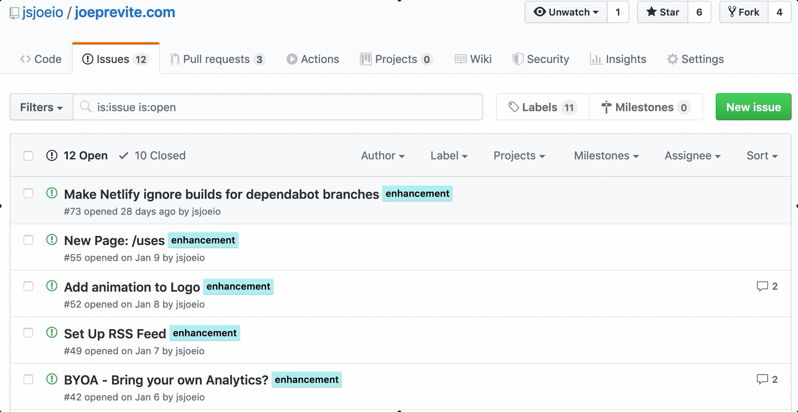

Similar to [PR templates](https://joeprevite.com/github-pr-template), issue templates are another favorite of mine when setting up projects on GitHub. You've probably seen them if you've opened an issue on an open source project. It looks like this:



If you prefer to learn by watching, you can find this on [egghead](https://egghead.io/lessons/github-create-a-github-issue-template?af=fd8rz3).

Here's how you can set it up:

1. Create a `.github` directory at the root of your project
2. Create an `ISSUE_TEMPLATE` directory inside the `.github` directory
3. Add a file called `bug_report.md` . Here's an example:

```markdown
---
name: Bug report 🐞
about: Create a report to help us improve
title: ''
labels: bug
assignees: ''
---

**Describe the bug**
A clear and concise description of what the bug is.

**To Reproduce**
Steps to reproduce the behavior:

1. Go to '...'
2. Click on '....'
3. Scroll down to '....'
4. See error

**Expected behavior**
A clear and concise description of what you expected to happen.

**Screenshots**
If applicable, add screenshots to help explain your problem.

**Desktop (please complete the following information):**

- Browser [e.g. chrome, safari]
- Version [e.g. 22]

**Additional context**
Add any other context about the problem here.
```

I usually set one up for feature requests too. If you want to do that, create a file called `feature_request.md` and markdown like this:

```markdown
---
name: Feature Request 💡
about: Suggest a new idea for the project.
labels: enhancement
---

## Summary

Brief explanation of the feature.

### Basic example

If the proposal involves a new or changed API, include a basic code example. Omit this section if it's not applicable.

### Motivation

Why are we doing this? What use cases does it support? What is the expected outcome?
```

3. Make sure these changes are on the default branch
4. Open an issue and viola! See your template in action.

Enjoy the added benefits of using issue templates!
